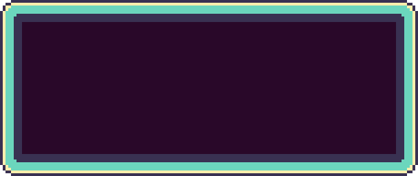
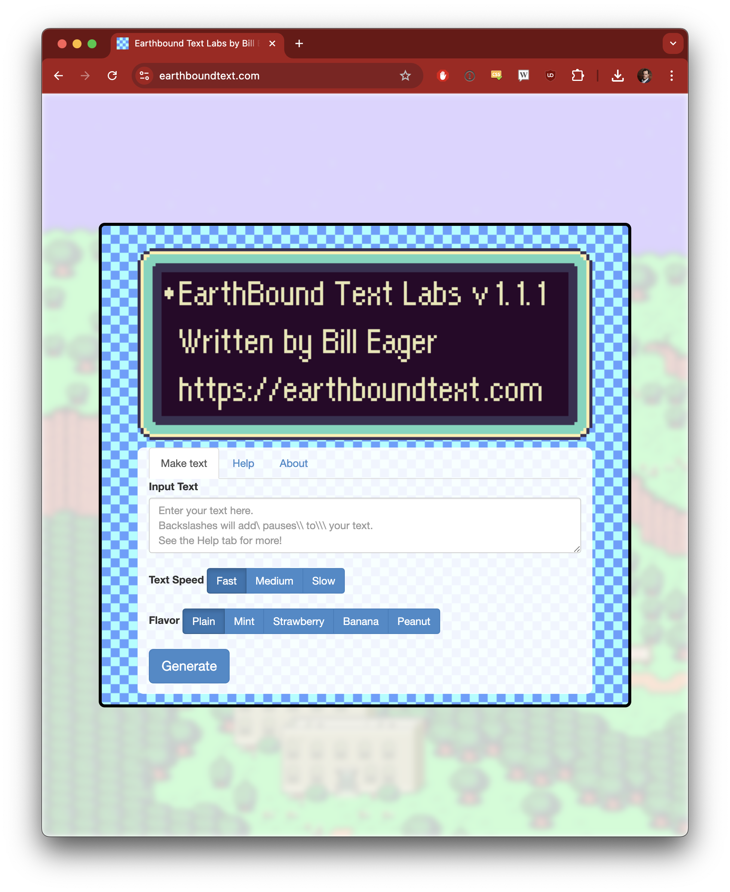

EarthBound Text Generator
======

EarthBound Text Generator is a lightweight web application that allows you to generate animated dialog boxes in the style of EarthBound, the cult classic Super Nintendo RPG known in Japan as Mother 2, and download those dialog boxes as animated GIF files.

EarthBound Text Generator was written by [Bill Eager](https://billeager.com) and is powered by [gif.js](https://github.com/jnordberg/gif.js) by Johan Nordberg.

EarthBound Text Generator is not affiliated with Shigesato Itoi, Nintendo, or HAL Laboratories.

## How to use

You can use EarthBound Text Generator by visiting the official website, [https://earthboundtext.com](https://earthboundtext.com).

If you prefer, you can clone this repo and run EarthBound Text Generator locally. You just need to run a static server from the root of the repository—no fancy containerization, compiling, or newfangled build system here, no sir.

## How to develop

If you're into that sort of thing, you can modify EarthBound Text Generator. Go nuts, but don't say I didn't warn you about the following:

* This project relies on very old versions of libraries that have gone out of style, like jQuery and Bootstrap. Upgrading any of those may introduce unintended bugs.
* Most of the innards of the generator live in [scripts/lib/ebtext.js](scripts/lib/ebtext.js). Most of the outards of the generator live in [index.html](index.html).
* This project maps EarthBound's text glyphs from an in-game sprite sheet, which were tailored for English dialog as EarthBound is an English-language game. As such, it is not trivial to add support for languages with extended Latin character sets, or languages with other character sets. Even the Japanese glyphs, if mapped, would only cover the limited characters supported by the game.
* Browser modernization has broken the generator/image quality of generated GIFs on occasion. If that happens, put an issue in this project and I'll get to it one of these decades.

## Frequently asked questions

*Can I use the GIFs I generated with the generator in my [game/movie/school project]?*

Yes.

*Can you add support for [language/unicode/emoji]?*

Most likely not. The generator is limited to the glyphs that are provided by the game. Anything beyond that is outside the scope of this project.

*Can you create a generator for Mother 1/Mother 3?*

I probably won't. EarthBound has a special place in my heart in a way that those other games don't. If you need a fix of other video game text generators, check out [The Death Generator](https://deathgenerator.com/).

*Do people really frequently ask you these questions?*

Yeah. Maybe. Not really. I guess a little bit.